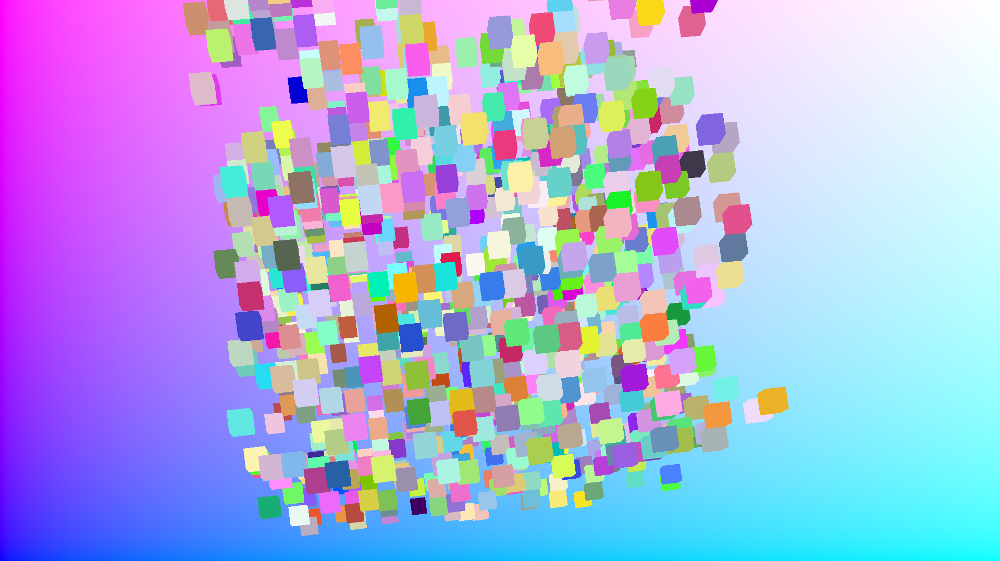
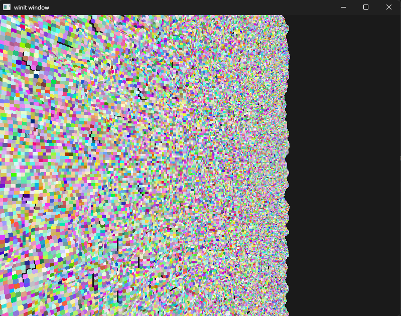

# The "Ultimate" voxel engine Project

This project is my attempt at the ultimate voxel engine, built in rust using wgpu.
I started this project in order to get more familiar with both wgpu and Rust, by building a project I would like doing.

## Features

### Rasterization renderer
I plan to support rasterization rendering of the terrain mostly to compare performance against the path tracer.
Most of it is already in place and can be ran using:
``` cargo --features rasterization ```
It is still very basic and doesn't even support lighting yet.

### Path Tracer
This is the main way I plan on rendering the scene. A start is made by using a compute shader to calculate each pixel.
I still plan on accelerating this by using some sort of acceleration structure.
i.e. BVH, Octree.
I want to support a dynamically generated scene, so I need to figure out a way to allow changing bounds of certain nodes.

### Terrain Generation
I have some simple perlin noise terrain generation setup for the rasterizer, but it is not yet in use by the path tracer.
I plan to improve this when I either feel like doing so or to improve stress testing of my path tracer.

## Example pictures

Path tracer in action:


Rasterization + Chunk generation:


## Controls
The camera can be controlled through the mouse and WASD for the Path tracer.
I plan to upgrade the rasterization camera movement to be the same, but right now you can only move using WASD.